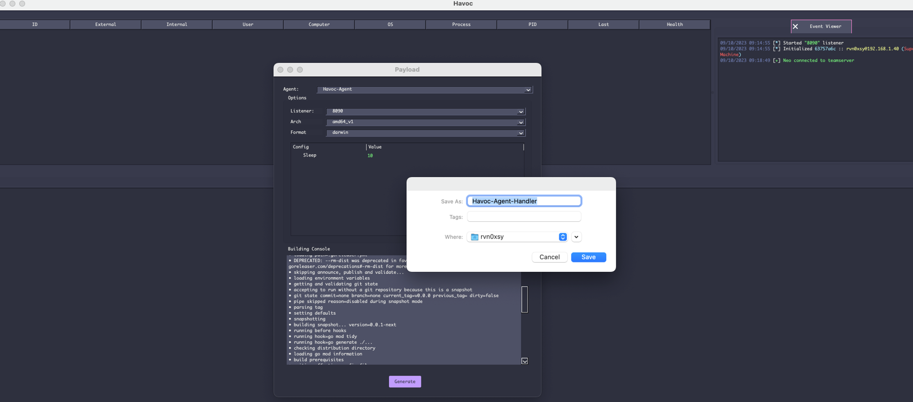

# Havoc-Agent-Handler


[Havoc C2 Agent开发记录](https://payloads.online/archivers/2023/10/12/fda899c9-47ea-40e6-b6fc-a00600ccc9cb)




## What is this?
This is a third party agent for Havoc C2 written in golang. 

## Features

support operating systems:

- Windows
- Linux
- MacOS

It currently only supports 4 commands:

- shell {system command}
- download {file_path}
- cat {file_path}
- shell_script {file_path}
- ~~exit~~

 have made some changes to the command execution module to interact with spawned processes through standard input (STDIN) in order to evade detection from some security software that monitors the command line. By communicating between processes via STDIN instead of directly executing commands on the CLI, it obscures the command contents within the IPC traffic, which looks like normal program interaction on the surface. This poses more challenges for antivirus and monitoring tools to detect. However, one still needs to be cautious of potential indicators that could be uncovered through deep analysis. Going forward I plan to experiment with other techniques like DLL injection for concealed command execution to further improve the evasion capabilities of this agent.

## Install

```
sudo pip install -r requirements
```

## Usage
1. start Havoc teamserver
2. python handler.py

